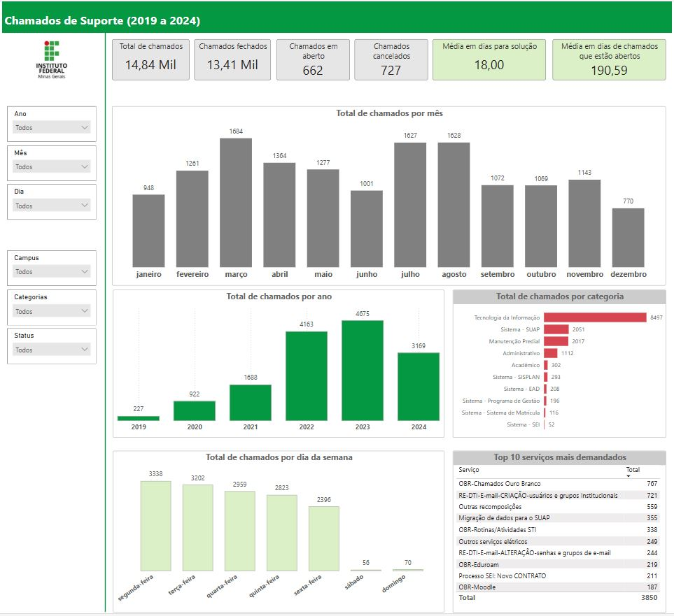

# 📊 Chamados de Suporte do IFMG

Este projeto realiza o processo de **ETL (Extract, Transform, Load)** em uma base de dados pública de chamados de suporte disponibilizada pelo **Instituto Federal de Minas Gerais (IFMG)** e apresenta os dados de forma visual através de um dashboard interativo no **Power BI**.

---

## 🗂️ Base de Dados

- **Fonte**: [Chamados de Suporte - IFMG](https://dadosabertos.ifmg.edu.br/dataset/chamados-de-suporte/resource/a7efa452-03d9-435d-82f8-f7344516ad72)
- **Formato**: CSV
- **Período**: 2019 a 2024
- **Tamanho**: +14 mil chamados registrados

---

## 🛠️ Ferramentas Utilizadas

- **Power BI**: Para a criação do dashboard e o processo de ETL.
- **Power Query**: Para limpeza e transformação dos dados.
- **Excel**: Para validação e pré-análise dos dados.

---

## 📊 Dashboard

  

Você pode acessar o dashboard interativo através do link abaixo:

🔗 [Dashboard no Power BI](https://app.powerbi.com/view?r=eyJrIjoiNjk5ZTk4ZmItNmZkNi00NTk4LThiYzktMTJhNmQ1NjVkMWE4IiwidCI6IjA3M2ZmOGM0LWExZDEtNDNiYi1iODNmLWQyNTQ0YmMzODZiMCIsImMiOjh9)

---

## 🚀 O Que Foi Feito

1. **Extração**: Coleta dos dados do portal de dados abertos do IFMG.
2. **Transformação**:
   - Limpeza dos dados (remoção de duplicatas e tratamento de valores nulos).
   - Criação de novas colunas para análise (ano, mês, dia da semana).
   - Padronização de categorias e status dos chamados.
3. **Carga**: Importação dos dados tratados para o Power BI.
4. **Visualização**: Criação de gráficos e métricas chave para análise dos chamados.

---

## 📈 Resultados Encontrados

- **Total de Chamados**: 14.840 chamados registrados entre 2019 e 2024.
- **Chamados Fechados**: 13.410 chamados foram resolvidos.
- **Tempo Médio de Solução**: 18 dias.
- **Mês com Mais Chamados**: Março.
- **Categoria Predominante**: Tecnologia da Informação com mais de 6 mil chamados.
